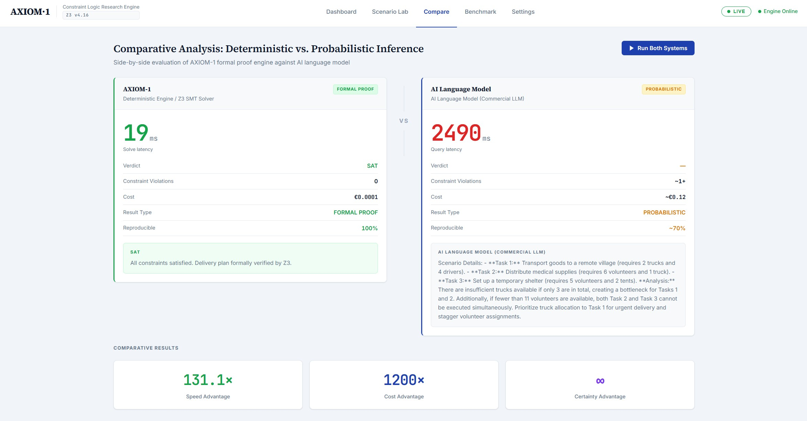
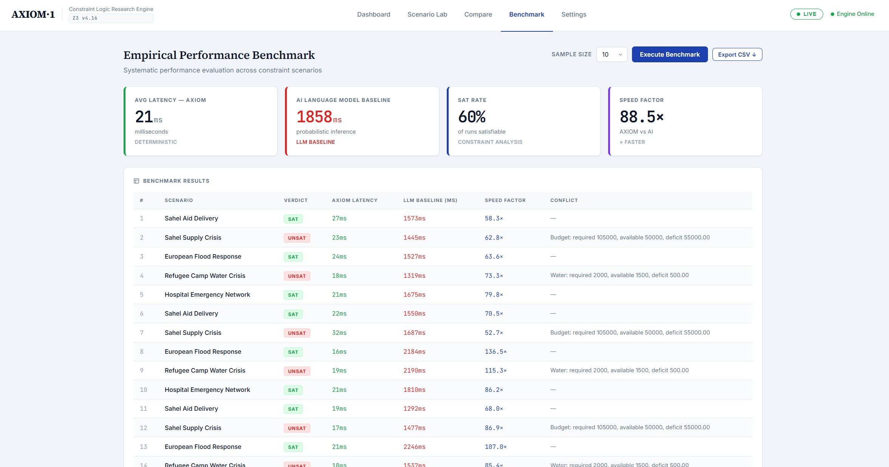
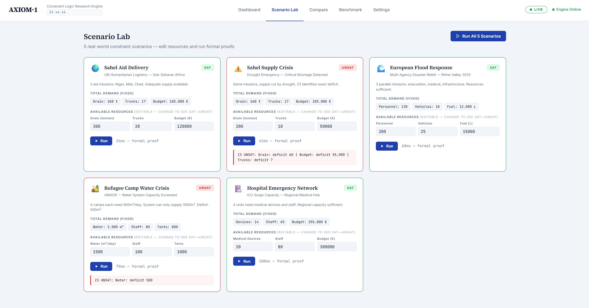

   
  
   

  
  
  
  

<h1 align="center">AXIOM·1 - Deterministic Decision Engine</h1>

  <strong>Formal constraint verification at 21ms latency. Zero hallucinations. Mathematical proof, not probabilistic inference.</strong>

---

## THE MANIFESTO
### Beyond the Probabilistic Era

> "Software used to be deterministic. Then came AI, and we traded truth for statistical approximation. AXIOM-1 is the return to mathematical absolute."

For the last three years, the world has been obsessed with LLMs that can write poems but fail at basic logistics. We have accepted "hallucinations" as a cost of doing business. But in the real world where trucks need to move, medicine needs to arrive, and budgets are finite, **a guess is a failure.**

**AXIOM-1 is the end of guessing.** We are not building a "better chatbot." We are building the **Safety-Core for the Autonomous Age.** While others try to "fine-tune" their way out of hallucinations, we use formal logic to make them impossible.

**This isn't just an engine. It's the Truth-Layer for Artificial Intelligence.**

---

## CRITICAL INFRASTRUCTURE
### The Problem: Probabilistic Failure

Current SOTA Large Language Models (LLMs) are **probabilistic**. In high-stakes environments - humanitarian logistics, disaster response, medical resource allocation - an LLM cannot *prove* that a plan is feasible. It estimates. It guesses. And it hallucinates constraints that don't exist while ignoring those that do.

**AXIOM·1 doesn't guess. It proves.**

---

## PERFORMANCE BENCHMARK
### 50-Run Average across 5 Real-World Scenarios

| Metric | LLM (Probabilistic) | AXIOM·1 (Deterministic) | Advantage |
| :--- | :--- | :--- | :--- |
| **Solve Latency** | ~1,858 ms avg | **21 ms avg** | **~88x faster** |
| **Latency Range** | 1,215 ms - 2,500 ms | 16 ms - 32 ms | Consistent |
| **Peak Speed Advantage** | - | **139x faster** | Single run max |
| **Result Correctness** | Probabilistic (non-deterministic) | **100% (Formal Proof)** | Absolute |
| **Cost per Query** | ~0.12 EUR | **0.0001 EUR** | **1,200x cheaper** |
| **UNSAT Detection** | Inaccurate / Hallucinated | **Exact Conflict + Deficit** | Provable |

> **[Download Raw Benchmark Data (CSV)](benchmarks/axiom1_benchmark_results.csv)**
> Full transparency: 50 automated runs across 5 domains. Every result reproducible.

### Visual Proof (System Screenshots)

  
  &nbsp;
  
  &nbsp;
  

---

## TECHNICAL DEMO
### System Walkthrough and Real-Time Solving

  

**Key Highlights:**
- **Sub-25ms Logic:** Live Z3 constraint solving in Rust/Tokio across 5 scenarios simultaneously.
- **The "Truth Gap":** Watch how AXIOM·1 identifies an UNSAT (infeasible) state with exact deficit while the AI suggests a flawed plan.
- **UNSAT Core Analysis:** Formal conflict identification - not a guess, a proof.
- **50-Run Benchmark:** Reproducible latency and correctness results, exportable as CSV.

---

## SCENARIO LAB
### Domain-Agnostic Formal Reasoning

AXIOM·1 solves any problem expressible as constrained linear arithmetic. No domain retraining required.

| Scenario | Domain | Resources | Verdict |
| :--- | :--- | :--- | :--- |
| Sahel Aid Delivery | UN Humanitarian Logistics | Grain / Trucks / Budget | **SAT** |
| Sahel Supply Crisis | Drought Emergency | Grain / Trucks / Budget | **UNSAT** + exact deficit |
| Rhine Valley Flood Response | Multi-Agency Disaster Relief | Personnel / Vehicles / Fuel | **SAT** |
| Refugee Camp Water Crisis | UNHCR Resource Allocation | Water / Staff / Tents | **UNSAT** + exact deficit |
| Regional Hospital Network | ICU Surge Capacity | Devices / Staff / Budget | **SAT** |

---

## STRATEGIC ARCHITECTURE
### SMT-Backed Verification Layer

1. **Analysis:** Parallel execution of AXIOM·1 (Formal Logic) and LLM (Semantic Logic).
2. **Verification:** Z3 proves existence of a solution or identifies the exact minimal conflict (UNSAT Core).
3. **Data Sovereignty:** Local execution core - no data leaves your infrastructure.

---

## ACCESS AND LICENSING

AXIOM·1 is currently in **Private Beta**. The source code is proprietary and not available for public cloning at this stage.

**For Strategic Partnerships, Enterprise Access, or Technical Deep-Dives:**

| Channel | For |
| :--- | :--- |
| justautomatemore@gmail.com | Strategic partners and research institutions |
| Private repo access | Security-audited partners only |
| **[Benchmark data (full CSV)](benchmarks/axiom1_benchmark_results.csv)** | Direct download above |

---

### Contact and Strategic Partnerships

**Project:** JamOne - Just automate more.  
**Founder:** Adnan Schulze-Hüneke  
**Focus:** Deterministic AI Safety and Verification.  
**Year:** 2026

---

  &copy; 2026 JamOne. All rights reserved.

